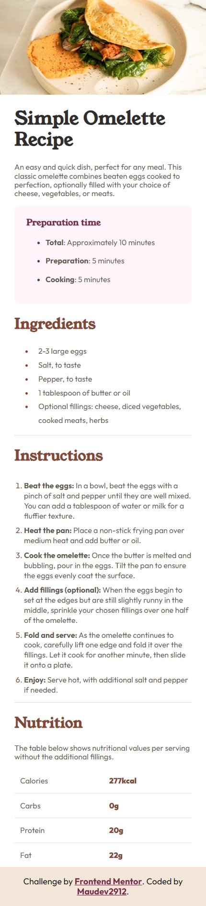
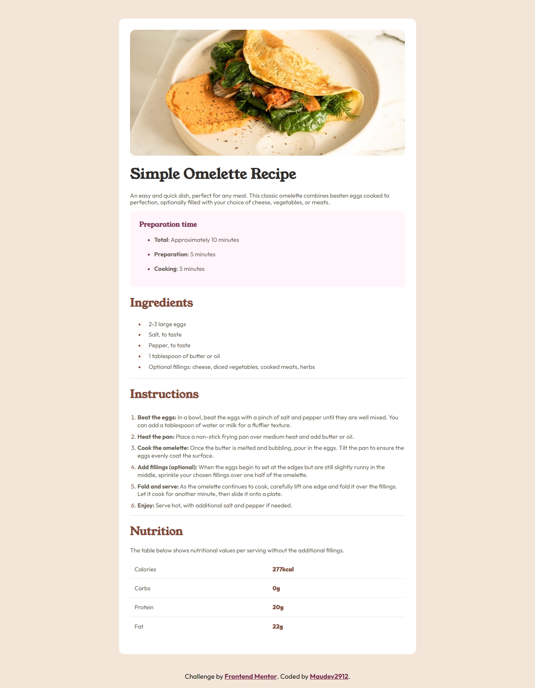

# Frontend Mentor - Recipe page solution

This is a solution to the [Recipe page challenge on Frontend Mentor](https://www.frontendmentor.io/challenges/recipe-page-KiTsR8QQKm). Frontend Mentor challenges help you improve your coding skills by building realistic projects. 

## Table of contents

- [Overview](#overview)
  - [The challenge](#the-challenge)
  - [Screenshot](#screenshot)
  - [Links](#links)
- [My process](#my-process)
  - [Built with](#built-with)
  - [What I learned](#what-i-learned)
  - [Continued development](#continued-development)
  - [Useful resources](#useful-resources)
  - [AI Collaboration](#ai-collaboration)
- [Author](#author)
- [Acknowledgments](#acknowledgments)

**Note: Delete this note and update the table of contents based on what sections you keep.**

## Overview

### Screenshot




### Links

- Solution URL: [GitHub](https://github.com/Maudev2912/recipe-page-main)
- Live Site URL: [Recipe Page Main](https://maudev2912.github.io/recipe-page-main/)

## My process

### Built with

- **HTML5 Semántico:** Uso adecuado de etiquetas como `<article>`, `<section>`, `<header>`, `<ul>`, `<ol>` y `<table>`.
- **Propiedades personalizadas de CSS (Variables):** Para la paleta de colores (`--stone-100`, `--brown-headig`, etc.) y tipografía.
- **Metodología BEM (Block Element Modifier):** Nombramiento claro y mantenible de clases CSS.
- **Diseño Responsive:** Media queries para adaptar la tarjeta entre dispositivos móviles y de escritorio.
- **Modelo de Caja y Tablas:** Uso de `border-collapse`, pseudoclases como `:last-of-type` y pseudoelementos `::marker` para personalizar listas.


### What I learned

En este proyecto reforcé y aprendí conceptos clave de maquetación web:

1. **Construcción de tablas semánticas y accesibles:**
   Aprendí a maquetar una tabla sin cabecera general usando `<tbody>` y `<th>` con el atributo `scope="row"` para vincular el nombre del nutriente con su valor:

```html
 <table class="table">
  <tbody class="table__body">
   <tr class="table__tr">
      <th class="table__title" scope="row">Calories</th>
      <td class="table__data">277kcal</td>
    </tr>
    <tr class="table__tr">
      <th class="table__title" scope="row">Carbs</th>
      <td class="table__data">0g</td>
    </tr>
    <tr class="table__tr">
      <th class="table__title" scope="row">Protein</th>
      <td class="table__data">20g</td>
    </tr>
    <tr class="table__tr">
      <th class="table__title" scope="row">Fat</th>
      <td class="table__data">22g</td>
    </tr>
  </tbody>
</table>
```
2. **Estilización fina con CSS:**
Comprendí cómo funcionan los bordes en el modelo de caja de las tablas y cómo eliminar la última línea horizontal apuntando directamente a las celdas de la última fila:
```css
.table__data,
.table__title{
    padding: 1.6rem 1.2rem;
    text-align: left;
    border-bottom: 1px solid var(--stone-100);
    
}

.table__tr:last-of-type .table__title,
.table__tr:last-of-type .table__data {
border-bottom: none;
}
```
3. **Personalización de números y viñetas:**
Utilicé el pseudoelemento ::marker para darle color a los números de la lista ordenada y a los puntos de los ingredientes según la paleta del diseño:

```css
.instructions__item::marker {
  color: var(--brown-headig);
}
```


### AI Collaboration

Durante el desarrollo de este proyecto, utilicé herramientas de Inteligencia Artificial **(Gemini y Claude) como asistentes de aprendizaje y evaluación:**

- **Consultas y mejores prácticas:** Utilicé la IA para resolver dudas conceptuales (como la estructura correcta de tablas HTML y el comportamiento de bordes en CSS), solicitar sugerencias sobre la semántica del código y aplicar buenas prácticas con BEM.

- **Evaluación y retroalimentación:** La empleé para analizar mi código final y recibir una puntuación con feedback detallado, similar a la revisión de un profesor, identificando áreas de mejora en la maquetación responsive y nombres de clases.


## Author

- Website - [GitHub](https://github.com/Maudev2912)
- Frontend Mentor - [@Maudev2912](https://www.frontendmentor.io/profile/Maudev2912)

